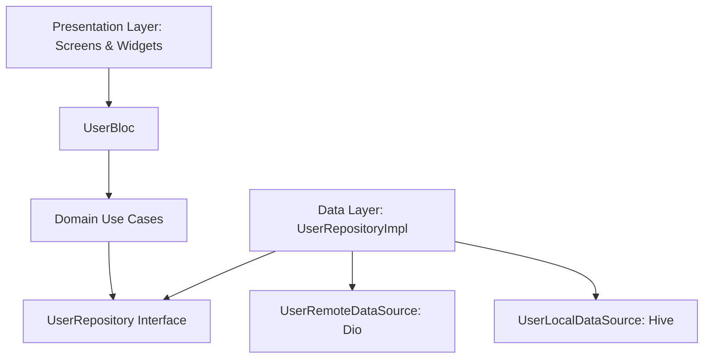
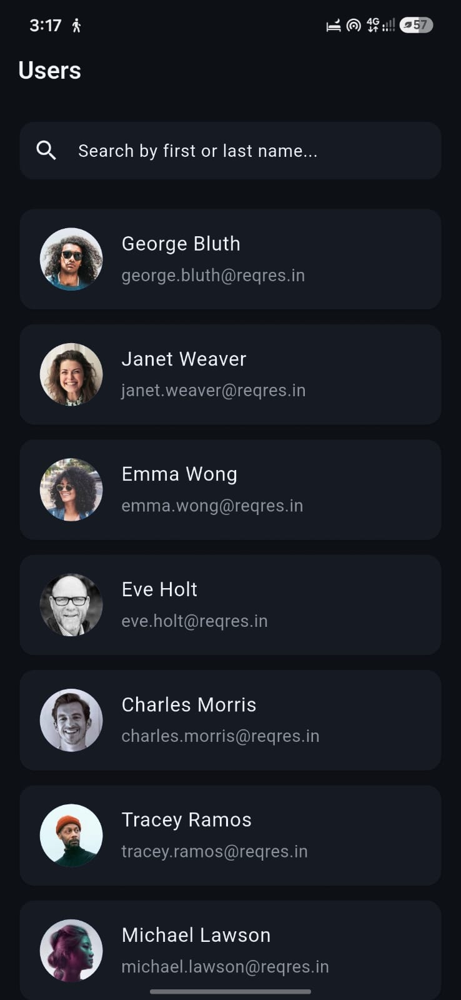

# User Directory App (`user_directory_app`) 🚀

A production-ready Flutter mobile application designed to fetch, display, search, and cache user profiles from public REST APIs. Built with **Clean Architecture**, **BLoC State Management**, **SOLID Principles**, **Hive Local Caching**, **Dio Networking**, **GoRouter**, **ScreenUtil Responsiveness**, and automated **Unit & Widget Tests**.

---

## 📁 Folder Structure Tree

```text
lib/
├── core/                        # Shared Core Modules & Infrastructure
│   ├── constants/               # AppStrings, AppIcons, AppColors, AppConstants
│   ├── error/                   # Failure & Exception classes
│   ├── network/                 # DioClient & NetworkInfo (Connectivity)
│   ├── routes/                  # AppRouter (GoRouter setup)
│   └── theme/                   # AppTheme & Roboto TextStyles
├── features/
│   └── users/
│       ├── data/                # Datasources (Remote & Local), Models, RepositoryImpl
│       ├── domain/              # Entities, Repository Interface, Use Cases
│       └── presentation/        # BLoC, Screens, Modular Widgets
├── injection_container.dart     # Service Locator (GetIt) Setup
└── main.dart                    # Application Entry Point
```

---

## 🏗 Architecture Explanation (Clean Architecture + BLoC)

The application adheres strictly to **Clean Architecture** combined with the **BLoC Pattern** to guarantee separation of concerns, testability, and scalability across 3 distinct layers:

### 1. Presentation Layer
- **BLoC (`UserBloc`, `UserEvent`, `UserState`)**: Manages state transitions using event-driven streams. Integrates RxDart `debounceTime` (300ms) and `switchMap` for search request throttling and cancellation.
- **UI (`UserListScreen`, `UserDetailScreen`, `widgets/`)**: Modular, single-responsibility responsive widgets scaled using `flutter_screenutil`.

### 2. Domain Layer (Pure Dart)
- **Entities (`UserEntity`)**: Fundamental business objects inheriting from `Equatable`.
- **Use Cases (`GetUsersUseCase`, `SearchUsersUseCase`)**: Enforces single-responsibility business rules returning `Either<Failure, T>`.
- **Repository Interface (`UserRepository`)**: Contract defining user data access behaviors without exposing implementation details.

### 3. Data Layer
- **Data Sources (`UserRemoteDataSource`, `UserLocalDataSource`)**: Executes network calls via Dio and handles local offline persistence via Hive.
- **Models (`UserModel`)**: Extends `UserEntity` to perform JSON serialization (`fromJson`, `toJson`) and type conversion (`toEntity`).
- **Repository Implementation (`UserRepositoryImpl`)**: Implements `UserRepository`, orchestrating remote fetching, Hive caching, and offline fallback logic based on `NetworkInfo` connectivity state.



---

## ⚡ Setup Instructions

### Prerequisites
- [Flutter SDK](https://flutter.dev/docs/get-started/install) (`>=3.11.0`)
- Dart SDK (`>=3.0.0`)
- Android Studio / VS Code with Flutter extension

### Quick Start
1. **Clone the repository:**
   ```bash
   git clone https://github.com/aviekhande/flutter-user-directory.git
   cd flutter-user-directory
   ```

2. **Install project dependencies:**
   ```bash
   flutter pub get
   ```

3. **Run code analysis:**
   ```bash
   flutter analyze
   ```

4. **Run automated test suite:**
   ```bash
   flutter test
   ```

5. **Launch the app:**
   ```bash
   flutter run
   ```

---

## 📦 Dependencies Table

| Package Name | Version | Purpose |
| :--- | :---: | :--- |
| [`flutter_bloc`](https://pub.dev/packages/flutter_bloc) | `^9.0.0` | Event-driven State Management pattern |
| [`rxdart`](https://pub.dev/packages/rxdart) | `^0.28.0` | Reactive search debouncing (`debounceTime`, `switchMap`) |
| [`dio`](https://pub.dev/packages/dio) | `^5.8.0` | Powerful HTTP client with timeout & interceptors |
| [`hive`](https://pub.dev/packages/hive) | `^2.2.3` | Lightweight, fast key-value local storage |
| [`hive_flutter`](https://pub.dev/packages/hive_flutter) | `^1.1.0` | Hive extension for Flutter applications |
| [`get_it`](https://pub.dev/packages/get_it) | `^8.0.3` | Service Locator dependency injection |
| [`go_router`](https://pub.dev/packages/go_router) | `^14.8.0` | Declarative routing and navigation |
| [`flutter_screenutil`](https://pub.dev/packages/flutter_screenutil) | `^5.9.3` | Dynamic UI responsiveness scaling |
| [`connectivity_plus`](https://pub.dev/packages/connectivity_plus) | `^6.1.4` | Device internet connectivity detection |
| [`cached_network_image`](https://pub.dev/packages/cached_network_image) | `^3.4.1` | Network image caching with placeholders |
| [`dartz`](https://pub.dev/packages/dartz) | `^0.10.1` | Functional error handling (`Either<Failure, T>`) |
| [`equatable`](https://pub.dev/packages/equatable) | `^2.0.7` | Structural value equality comparisons |
| [`bloc_test`](https://pub.dev/packages/bloc_test) | `^10.0.0` | Testing utility for BLoCs and Cubits |
| [`mocktail`](https://pub.dev/packages/mocktail) | `^1.0.5` | Null-safe mock testing library |

---

## ✨ Features Checklist

- [x] **User List Screen**: Fetches and displays user list (avatar, name, email).
- [x] **User Detail Screen**: Displays user avatar (`Hero` animation), full name, email, user ID, and phone number (if present) with tap-to-copy utility.
- [x] **Search Functionality**: Reactive search bar filtering users by name with RxDart 300ms debouncing and request cancellation.
- [x] **Infinite Scroll Pagination**: Automatically loads subsequent user batches when scrolling near the bottom of the list.
- [x] **Pull to Refresh**: Drag down to clear Hive cache and fetch updated user data from the server.
- [x] **Offline Mode & Caching**: Persists user lists locally in Hive; displays an interactive `OfflineBanner` with a **Retry** action when offline.
- [x] **Error & Edge Case Handling**: Gracefully handles network timeouts (>10s), server failures, and empty search results.
- [x] **Responsive UI**: Dynamic scaling across phone sizes using `flutter_screenutil`.
- [x] **Declarative Routing**: Managed via `go_router`.
- [x] **Unit & Widget Testing**: Comprehensive test coverage using `bloc_test` and `mocktail`.

---

## 🖼 App Screenshots

<p align="center">
  
  
</p>

---

## ⚠️ Known Limitations

1. **Public API Rate Limits & Constraints**:
   - The public ReqRes API defaults to a fixed maximum dataset (12 records across 2 pages). Pagination features operate up to the API's maximum total page count.
2. **Optional Phone Data**:
   - Standard public user list APIs (ReqRes / GitHub) do not return a native `phone` property in their list endpoint response payloads. The `phone` row on `UserDetailScreen` renders conditionally when present in the dataset.
3. **Hive Storage Size**:
   - Local Hive storage caches standard user list payloads for offline access. Extensive data reset requires executing a pull-to-refresh action.
