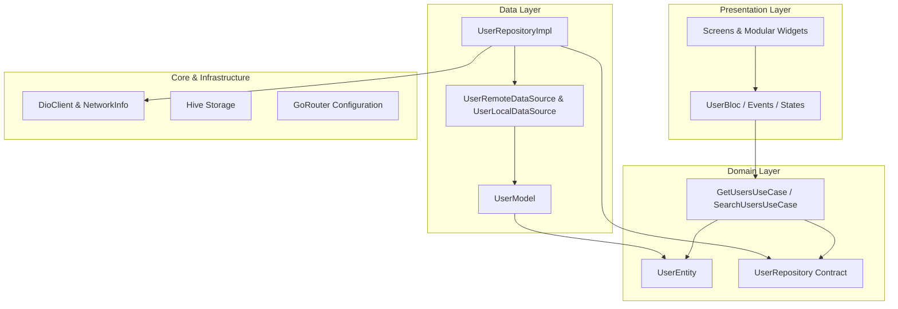

# Flutter User Directory Application 🚀

A production-grade, highly scalable Flutter application built for the **Flutter Developer Assignment**. The application fetches, searches, caches, and displays user profiles from the public ReqRes API following **Clean Architecture**, **BLoC State Management**, **SOLID Principles**, **Dio Networking**, **Hive Storage**, **GoRouter Navigation**, **ScreenUtil Responsiveness**, and a comprehensive **Unit & Widget Test Suite**.

---

## 📸 Key Features & Capabilities

- **User List Screen**: Infinite scroll pagination (`?per_page=10&page=1`), skeleton shimmer loading placeholders, pull-to-refresh capability.
- **User Detail Screen**: Detailed profile view showcasing high-resolution avatar (`Hero` animation & `CachedNetworkImage`), user name, email, ID, and phone number with quick tap-to-copy functionality.
- **Debounced Search**: Reactive search functionality using RxDart (`debounceTime` 300ms & `switchMap`) to eliminate redundant API requests and prevent search race conditions. Handles special characters, case-insensitivity, and whitespace trimming.
- **Offline Caching**: Caches user lists locally in **Hive** storage. Displays an interactive **Offline Banner** with a **Retry** button when connection is lost.
- **Error Handling**: Custom exception mapping returning `Either<Failure, Result>`, handling timeout exceptions (>10s), server failures, and empty search results gracefully.
- **Adaptive UI Responsiveness**: Built with `flutter_screenutil` (`.w`, `.h`, `.r`, `.sp`) ensuring responsive rendering across mobile devices and orientations.
- **Dependency Injection**: Integrated `get_it` service locator in `lib/injection_container.dart`.
- **Declarative Navigation**: Managed via `go_router` in `lib/core/routes/`.

---

## 🏗 Clean Architecture Overview

The app follows strict **Clean Architecture** with 3 distinct layers:



### Folder Structure

```text
lib/
├── core/                        # Infrastructure & Shared Utilities
│   ├── constants/               # AppStrings, AppIcons, AppConstants
│   ├── error/                   # Failures & Exceptions
│   ├── network/                 # DioClient & NetworkInfo (Connectivity)
│   ├── routes/                  # AppRouter (GoRouter configuration)
│   └── theme/                   # AppColors, AppTheme, kTextStyleRoboto...
├── features/
│   └── users/
│       ├── data/                # Datasources (Remote & Local), Models, RepositoryImpl
│       ├── domain/              # Entities, Repository Interfaces, Use Cases
│       └── presentation/        # BLoC, Screens, Modular Widgets
├── injection_container.dart     # Service Locator (GetIt) Setup
└── main.dart                    # Application Entry Point
```

---

## 🎯 Solution Matrix for Problem Scenarios

| Scenario | Architectural Solution & Implementation |
| :--- | :--- |
| **1. Slow API Response** | Configured a 10-second timeout on `DioClient`. Maps Dio timeouts to `TimeoutFailure` and displays a retryable error screen with timer icons. |
| **2. No Internet Connection** | `NetworkInfo` verifies online status using `connectivity_plus`. When offline, data is retrieved from local Hive storage, and an interactive `OfflineBanner` with a **Retry** action is presented. |
| **3. Empty API Response** | Detects empty responses, emitting `UserEmpty` state to display a clean `UserEmptyStateWidget` with a refresh button. |
| **4. Search Edge Cases** | Search input is trimmed and debounced (300ms) via RxDart `switchMap`, cancelling stale requests and sanitizing special character inputs. |
| **5. Memory Leaks & Navigation** | Managed with `go_router`. All `TextEditingController`s, `ScrollController`s, and `UserBloc` streams are properly disposed in `dispose()`. |
| **6. UI Responsiveness** | Layout dimensions (`.w`, `.h`, `.r`) and typography (`.sp`) dynamically adapt across screen sizes using `flutter_screenutil`. |
| **7. Stale Cache Management** | Triggering Pull-To-Refresh clears local Hive cache before executing a fresh network fetch from ReqRes API. |

---

## 🛠 Tech Stack

- **Core Framework**: Flutter (Dart SDK ^3.11.4)
- **State Management**: `flutter_bloc` (^9.0.0) + `rxdart` (^0.28.0)
- **Networking**: `dio` (^5.8.0)
- **Local Storage / Caching**: `hive` & `hive_flutter` (^2.2.3)
- **Dependency Injection**: `get_it` (^8.0.3)
- **Routing & Navigation**: `go_router` (^14.8.0)
- **Screen Responsiveness**: `flutter_screenutil` (^5.9.3)
- **Functional Programming**: `dartz` (^0.10.1) & `equatable` (^2.0.7)
- **Testing**: `flutter_test`, `bloc_test`, `mocktail`

---

## 🚀 Setup & Execution Instructions

### Prerequisites
- [Flutter SDK](https://flutter.dev/docs/get-started/install) (version 3.11.x or higher)
- Android Studio / VS Code with Dart & Flutter extensions

### Steps to Run
1. Clone the repository:
   ```bash
   git clone https://github.com/aviekhande/flutter-user-directory.git
   cd flutter-user-directory
   ```

2. Fetch project dependencies:
   ```bash
   flutter pub get
   ```

3. Run the application:
   ```bash
   flutter run
   ```

---

## 🧪 Testing

Run the full automated unit and widget test suite:
```bash
flutter test
```

Perform static code analysis:
```bash
flutter analyze
```

---

## ⚖️ License
This project is open-source under the MIT License.
